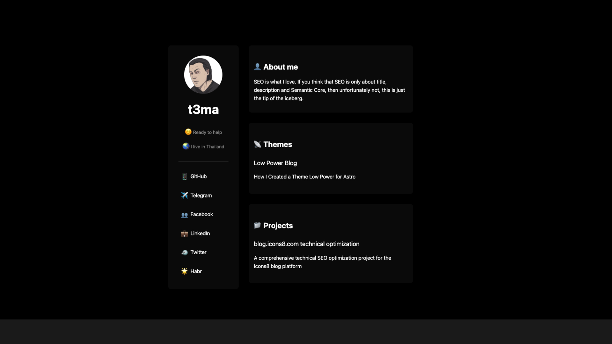
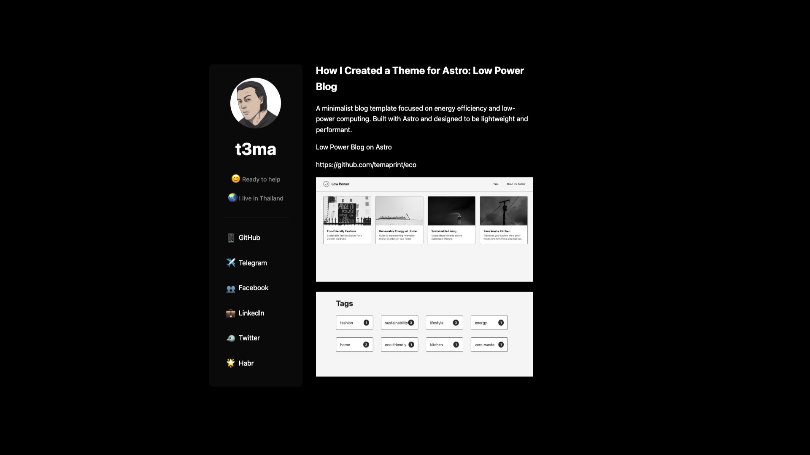

# Astro t3ma Blog Template



## Overview

This is a custom-built **Astro t3ma template** that serves as the foundation for publishing and showcasing various projects, themes, and technical insights. It is designed for performance, readability, and scalability while maintaining a modern aesthetic.

## Features

- 🚀 **Built with Astro** – A fast, static site generator for optimal performance.
- 🎨 **Tailwind CSS** – Ensures a clean, responsive, and modern UI.
- 📖 **Markdown & MDX Support** – Easily write and manage content.
- 🔍 **SEO-Optimized** – Structured metadata for better search visibility.
- 🏗 **Modular Components** – Designed with reusable Astro components.
- 📱 **Fully Responsive** – Works seamlessly on all devices.

## Blog Sections

This template hosts a variety of projects and blog posts, including:

### 🚀 **Themes & Templates**
- **Color Palettes** – A template to explore curated color palettes.
- **Freaky Font** – A bold typeface designed for developers and designers.
- **Bento Style for Astro** – A modern UI template inspired by Bento design.
- **Low Power Blog** – A minimalist and energy-efficient blogging theme.
- **topaitool.dev** – A curated AI tools directory for creators and developers.

### 📁 **Projects**
- **blog.icons8.com Technical Optimization** – SEO and technical improvements for the Icons8 blog platform.

### 💼 **Work Experience**
- **Icons8.com (2020 - Present)** – SEO Specialist
- **Citysakh.ru (2010 - 2020)** – CEO

## Installation & Setup

### 1️⃣ Clone the Repository
```bash
git clone https://github.com/temaprint/t3ma.git
cd t3ma
```

### 2️⃣ Install Dependencies
```bash
npm install
```

### 3️⃣ Start the Development Server
```bash
npm run dev
```

This will start a local server where you can preview the blog.

### 4️⃣ Build the Project
```bash
npm run build
```

### 5️⃣ Preview the Build
```bash
npm run preview
```

## Content Structure
```
/src/content/posts/   # Blog posts in Markdown/MDX
/src/content/pages/   # Static pages
/src/layouts/         # Layout files
/src/components/      # Reusable UI components
/public/images/       # Image assets
```

## Customization

- Modify content inside `/src/content/`
- Adjust styling in `/src/styles/`
- Add new layouts in `/src/layouts/`

## Deployment
To deploy, build the project and upload the `dist/` folder to a static hosting provider like **Vercel, Netlify, or GitHub Pages**:

```bash
npm run build
```

## License
This project is licensed under the **MIT License**. See the LICENSE file for details.

🚀 **Start your own Astro-powered blog today!**

